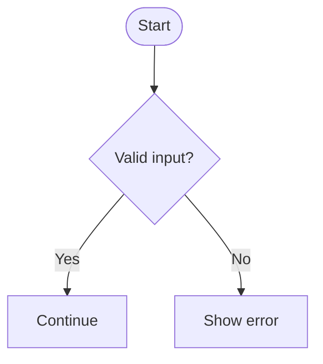

# Project Context: Diagramwright

Build a Next.js web application called **Diagramwright**.

Diagramwright is a visual diagram editor that lets users drag, drop, connect, and edit diagram nodes on a canvas, then copy the generated Mermaid syntax to their clipboard.

The goal is to make Mermaid diagram creation easier for users who think visually but still want clean, version-controllable diagram code.

## Core Product Goal

Users should be able to:

1. Open the web app.
2. Drag node types from a sidebar onto a canvas.
3. Connect nodes with edges.
4. Edit node labels.
5. See generated Mermaid syntax update live.
6. Copy the Mermaid output to their clipboard.
7. Optionally preview the rendered Mermaid diagram.

There is no authentication layer needed. Do not add login, signup, sessions, users, accounts, protected routes, or backend auth logic.

## Tech Stack

Use:

* Next.js with App Router
* TypeScript
* Tailwind CSS
* `@xyflow/react` for the visual node canvas
* Zustand for local client-side state
* Mermaid for rendering and validating Mermaid diagrams
* `lucide-react` for icons

The app should be primarily client-side. Use local state and browser storage where needed.

## Initial Scaffold

Create the app with:

```bash
npx create-next-app@latest diagramwright \
  --ts \
  --tailwind \
  --eslint \
  --app \
  --src-dir \
  --import-alias "@/*"

cd diagramwright

npm install @xyflow/react zustand mermaid lucide-react
```

## Recommended Repo Structure

```txt
diagramwright/
  src/
    app/
      page.tsx
      layout.tsx
      globals.css

    components/
      canvas/
        DiagramCanvas.tsx
        Sidebar.tsx
        Toolbar.tsx
        CustomNode.tsx
        MermaidPreview.tsx
        MermaidOutput.tsx

    lib/
      mermaid/
        graphToMermaid.ts
        sanitizeMermaidId.ts
      graph/
        defaultNodes.ts
        nodeTypes.ts

    store/
      diagramStore.ts

    types/
      diagram.ts
```

## Core Data Model

The visual graph should be the source of truth. Mermaid syntax should be generated from the graph state.

```ts
export type DiagramNodeKind =
  | "process"
  | "decision"
  | "terminal"
  | "database"
  | "subroutine";

export type DiagramNode = {
  id: string;
  label: string;
  kind: DiagramNodeKind;
  position: {
    x: number;
    y: number;
  };
};

export type DiagramEdge = {
  id: string;
  source: string;
  target: string;
  label?: string;
};

export type Diagram = {
  title?: string;
  direction: "TD" | "LR" | "BT" | "RL";
  nodes: DiagramNode[];
  edges: DiagramEdge[];
};
```

## Mermaid Export Logic

Start with Mermaid flowcharts only.

Do not support sequence diagrams, class diagrams, ER diagrams, state diagrams, or other Mermaid diagram types in the MVP.

Create a `graphToMermaid` function that converts the current graph state into Mermaid flowchart syntax.

```ts
import type { Diagram, DiagramNode } from "@/types/diagram";

function sanitizeMermaidId(id: string): string {
  return id.replace(/[^a-zA-Z0-9_]/g, "_");
}

function formatNode(node: DiagramNode): string {
  const id = sanitizeMermaidId(node.id);
  const label = node.label.replaceAll('"', "'");

  switch (node.kind) {
    case "decision":
      return `${id}{"${label}"}`;
    case "terminal":
      return `${id}(["${label}"])`;
    case "database":
      return `${id}[("${label}")]`;
    case "subroutine":
      return `${id}[["${label}"]]`;
    case "process":
    default:
      return `${id}["${label}"]`;
  }
}

function formatEdge(edge: Diagram["edges"][number]): string {
  const source = sanitizeMermaidId(edge.source);
  const target = sanitizeMermaidId(edge.target);

  if (edge.label?.trim()) {
    const label = edge.label.replaceAll("|", "/");
    return `${source} -->|${label}| ${target}`;
  }

  return `${source} --> ${target}`;
}

export function graphToMermaid(diagram: Diagram): string {
  const lines = [`flowchart ${diagram.direction}`];

  for (const node of diagram.nodes) {
    lines.push(`  ${formatNode(node)}`);
  }

  for (const edge of diagram.edges) {
    lines.push(`  ${formatEdge(edge)}`);
  }

  return lines.join("\n");
}
```

## Clipboard Utility

Add a small clipboard helper.

```ts
export async function copyToClipboard(value: string): Promise<void> {
  if (!navigator.clipboard?.writeText) {
    throw new Error("Clipboard API is not available in this browser.");
  }

  await navigator.clipboard.writeText(value);
}
```

## MVP Feature Scope

Build the first version around flowchart generation.

Required features:

* Canvas with pan and zoom
* Sidebar with draggable node types
* Add process, decision, terminal, database, and subroutine nodes
* Connect nodes with edges
* Edit node labels
* Edit edge labels
* Delete selected nodes and edges
* Choose Mermaid direction: `TD`, `LR`, `BT`, or `RL`
* Generate Mermaid syntax live
* Copy Mermaid syntax to clipboard
* Show the generated Mermaid text in a side panel
* Render a Mermaid preview panel
* Persist the current diagram to `localStorage`

## Explicit Non-Goals

Do not implement:

* Authentication
* User accounts
* Login or signup pages
* Protected routes
* Backend API routes for user data
* Database persistence
* Team sharing
* Cloud sync
* Payments
* Multi-tenant workspaces

This should be a lightweight local-first web application.

## Suggested UI Layout

Use a three-panel layout:

```txt
+----------------+-----------------------------+----------------------+
| Sidebar        | Canvas                      | Mermaid Output       |
|                |                             |                      |
| Node types     | Drag/drop editor            | Generated syntax     |
| Direction      | Visual graph                | Copy button          |
| Templates      |                             | Preview toggle       |
+----------------+-----------------------------+----------------------+
```

The app should feel like a focused developer tool.

## Initial Page Behavior

On load:

1. Initialize an empty diagram or a small example diagram.
2. Render the React Flow canvas.
3. Render the node palette sidebar.
4. Render the Mermaid output panel.
5. Generate Mermaid syntax whenever nodes, edges, labels, or direction change.
6. Save graph state to `localStorage`.
7. Restore graph state from `localStorage` on reload.

## Example Mermaid Output



## Good First Implementation Order

1. Create the Next.js app.
2. Install dependencies.
3. Build static layout with sidebar, canvas, and output panel.
4. Add React Flow canvas.
5. Add draggable node creation.
6. Add connectable edges.
7. Add editable labels.
8. Add graph-to-Mermaid conversion.
9. Add copy-to-clipboard.
10. Add Mermaid preview.
11. Add localStorage persistence.
12. Polish the UI.

## README Starter

````md
# Diagramwright

Drag, drop, wire, copy Mermaid.

Diagramwright is a Next.js and TypeScript web app for visually creating diagrams and exporting them as Mermaid syntax.

## Core Idea

Build diagrams on a canvas, then copy the generated Mermaid structure to the clipboard.

## Stack

- Next.js App Router
- TypeScript
- Tailwind CSS
- React Flow / `@xyflow/react`
- Zustand
- Mermaid

## MVP

- Drag nodes from a sidebar onto a canvas
- Connect nodes with edges
- Edit node labels
- Edit edge labels
- Generate Mermaid flowchart syntax
- Copy Mermaid output to clipboard
- Preview the rendered Mermaid diagram
- Persist state locally with `localStorage`

## Development

```bash
npm install
npm run dev
````

```

## Final Direction

Build this as a local-first visual Mermaid flowchart editor.

The visual canvas is the source of truth. Mermaid syntax is generated from that canvas state.

Keep the first version focused, fast, and simple. No auth. No backend. No database. No accounts.
```
