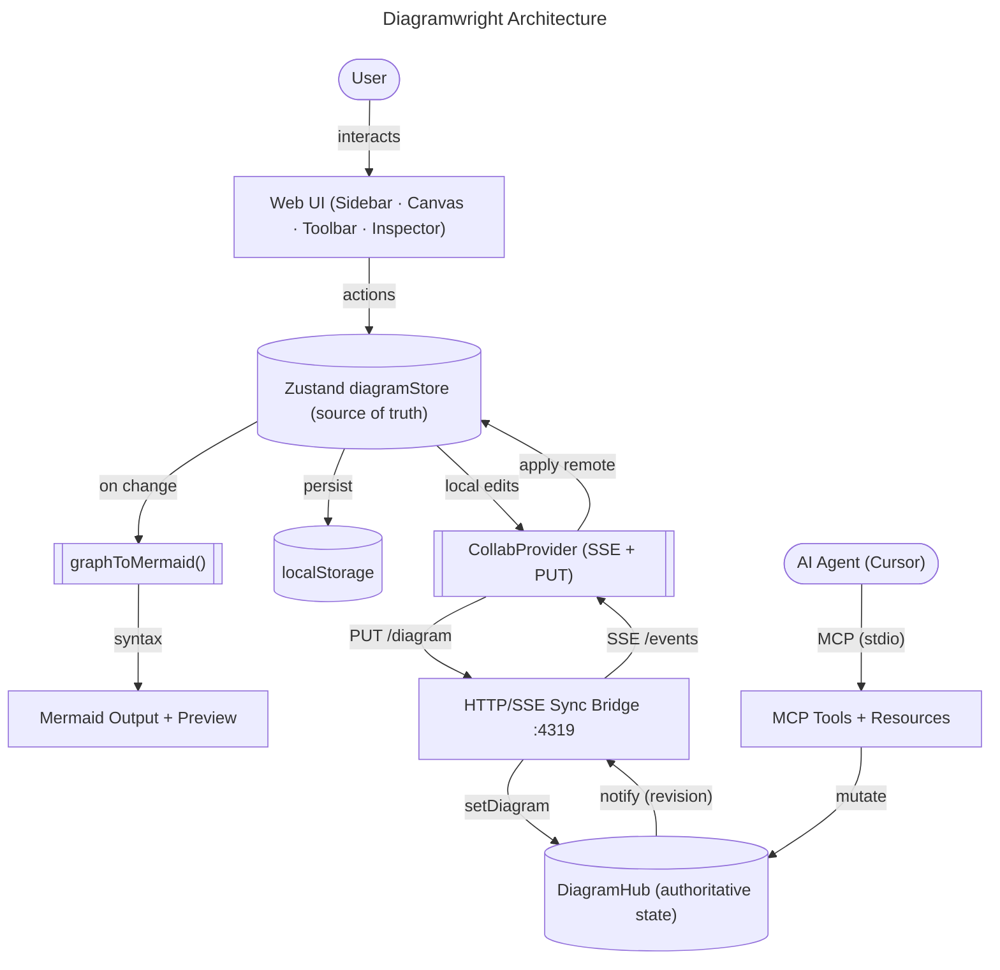

# Diagramwright Architecture

Diagramwright is a local-first visual editor for Mermaid flowcharts. The visual canvas is the single source of truth; Mermaid syntax is generated from it. A companion MCP server lets AI agents read and edit the same diagram in real time while a user works in the browser.

## System Overview



The system has two runtime processes:

- **The browser app** — a Next.js client app where the user builds diagrams.
- **The MCP server process** — exposes MCP tools to agents and runs an HTTP/SSE sync bridge that keeps the browser and agents in lockstep.

These are connected only through the local sync bridge; there is no cloud, database, or auth.

## Browser App

| Component | File | Responsibility |
| --- | --- | --- |
| Web UI | `src/components/canvas/*` | Sidebar palette, React Flow canvas, toolbar, inspector, output panel. |
| `diagramStore` | `src/store/diagramStore.ts` | Zustand store; the source of truth for nodes, edges, direction, title, selection. Persists to `localStorage`. |
| `graphToMermaid()` | `src/lib/mermaid/graphToMermaid.ts` | Pure function converting store state into Mermaid flowchart syntax. |
| Output + Preview | `src/components/canvas/OutputPanel.tsx` | Shows generated syntax (copyable) and the rendered Mermaid preview. |
| `CollabProvider` | `src/components/CollabProvider.tsx` | Connects the store to the sync bridge: pushes local edits, applies remote ones. |
| `themeStore` / `collabStore` | `src/store/*` | System/light/dark theme and live connection status. |

The visual graph in `diagramStore` drives everything else: any mutation re-runs `graphToMermaid()` for the output/preview, is persisted to `localStorage`, and is pushed to the bridge when collaboration is active.

## MCP Server

| Component | File | Responsibility |
| --- | --- | --- |
| MCP Tools + Resources | `mcp/src/server.ts` | Tools (`add_node`, `add_edge`, `set_diagram`, …) and resources (`diagram://current`, `diagram://mermaid`). |
| `DiagramHub` | `mcp/src/hub.ts` | Authoritative in-memory state with a monotonic revision and change listeners; optional file persistence. |
| Sync Bridge | `mcp/src/bridge.ts` | Local HTTP + SSE server (default port `4319`): `GET/PUT /diagram`, `GET /events`, `/health`. |
| Entrypoint | `mcp/src/index.ts` | Boots the hub, starts the bridge, connects the MCP stdio transport. |

The MCP server is launched by the agent client (e.g. Cursor, via `.cursor/mcp.json`). It speaks the MCP protocol over **stdio** by default, while the embedded bridge serves the browser over HTTP/SSE from the same process. For headless/containerized deployments it can instead expose MCP over **Streamable HTTP** (`MCP_TRANSPORT=http`, endpoint `/mcp`), so networked agents can connect without a local process.

## Data Flow

### Local editing loop

1. The user interacts with the Web UI.
2. UI components dispatch actions to `diagramStore`.
3. On change, `graphToMermaid()` regenerates syntax for the Output + Preview panel.
4. The store is persisted to `localStorage` and restored on reload.

### Agent collaboration loop

1. An agent calls an MCP tool → `DiagramHub` mutates and bumps its revision.
2. The hub notifies the bridge, which broadcasts an SSE `update` event (with an `origin`).
3. `CollabProvider` receives the event and applies the diagram to `diagramStore` — the canvas updates live.
4. Conversely, user edits flow `store → CollabProvider → PUT /diagram → bridge → hub`, where the agent can read them via `get_diagram` / resources.

The `origin` field on each change lets clients ignore their own echoed updates, preventing sync loops.

## Technology Stack

| Layer | Technology |
| --- | --- |
| Framework | Next.js (App Router), React 19, TypeScript |
| Styling | Tailwind CSS v4 (system/light/dark theme) |
| Canvas | React Flow (`@xyflow/react`) |
| State | Zustand (with `localStorage` persistence) |
| Diagram rendering | Mermaid |
| Icons | `lucide-react` |
| Agent integration | `@modelcontextprotocol/sdk` (stdio) + Node `http` bridge |

## Repository Layout

```txt
diagramwright/
  src/
    app/                # Next.js App Router (layout, page, globals)
    components/
      canvas/           # Sidebar, DiagramCanvas, Toolbar, Inspector, OutputPanel, Custom/Mermaid views
      CollabProvider.tsx
      ThemeProvider.tsx
    lib/
      mermaid/          # graphToMermaid, sanitizeMermaidId
      graph/            # nodeTypes, default/example diagrams
      collab/           # bridge config
    store/              # diagramStore, themeStore, collabStore
    types/              # diagram data model
  mcp/
    src/                # MCP server: hub, bridge, server (tools/resources), index
  docs/
    ARCHITECTURE.md     # this document
```

## Persistence

- **Browser:** the diagram is auto-saved to `localStorage` (`diagramwright:diagram`) and restored on load. Theme is stored under `diagramwright:theme`.
- **MCP:** `DiagramHub` is in-memory by default. Set `DIAGRAMWRIGHT_STATE_FILE` to persist diagram JSON across server restarts.

## Deployment

The stack ships as two Docker images orchestrated by `docker-compose.yml`:

| Service | Image | Ports | Notes |
| --- | --- | --- | --- |
| `web` | Next.js standalone build | 3000 | Browser app. |
| `mcp` | MCP server | 4319 (sync bridge), 4320 (`/mcp` HTTP) | Runs headless with `MCP_TRANSPORT=http`. |

Both services use `restart: unless-stopped` and `init: true` for crash recovery and correct signal handling. Diagram state persists to the `diagram-data` volume (`DIAGRAMWRIGHT_STATE_FILE=/data/diagram.json`). The browser-reachable bridge URL is baked at build time via the `NEXT_PUBLIC_DIAGRAMWRIGHT_BRIDGE_URL` build arg.

## Notes

- No authentication, accounts, or backend database — the only networked component is the local sync bridge.
- This very diagram is shipped as the app's built-in example (`src/lib/graph/defaultNodes.ts`), so a fresh canvas renders the architecture above.
